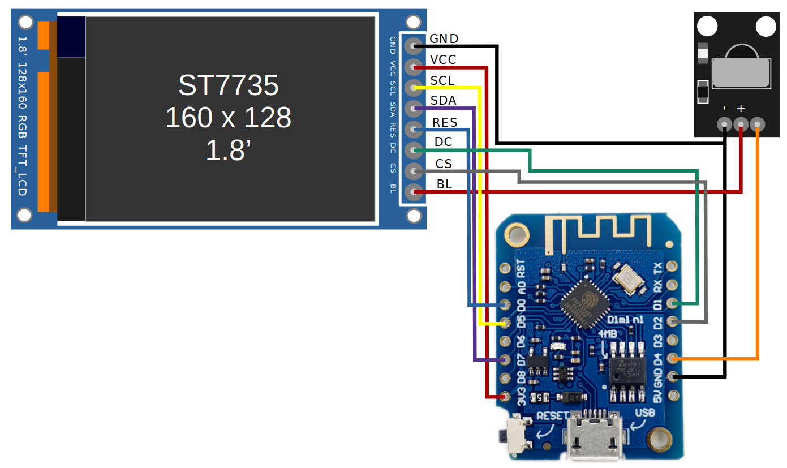
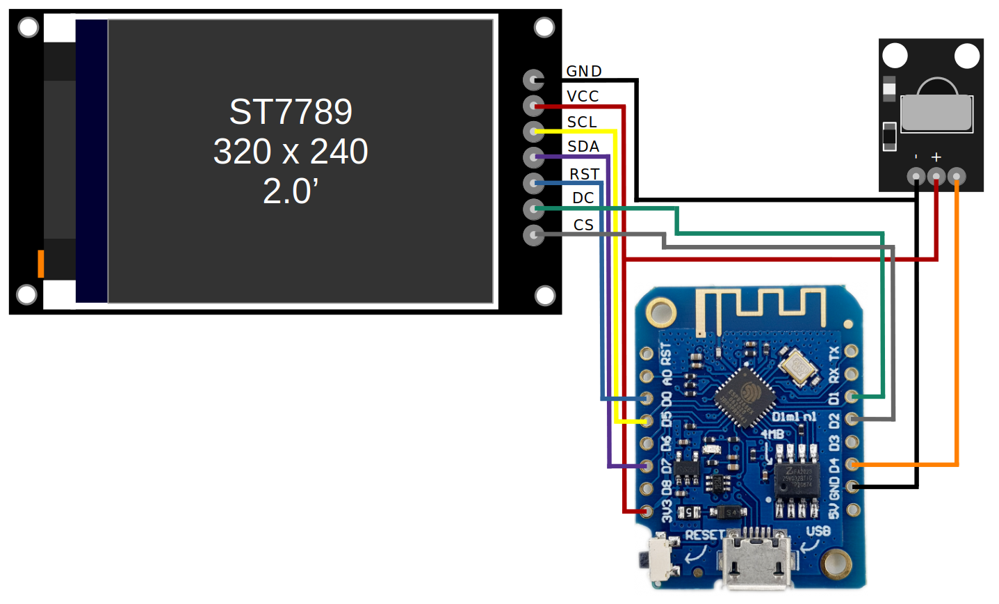
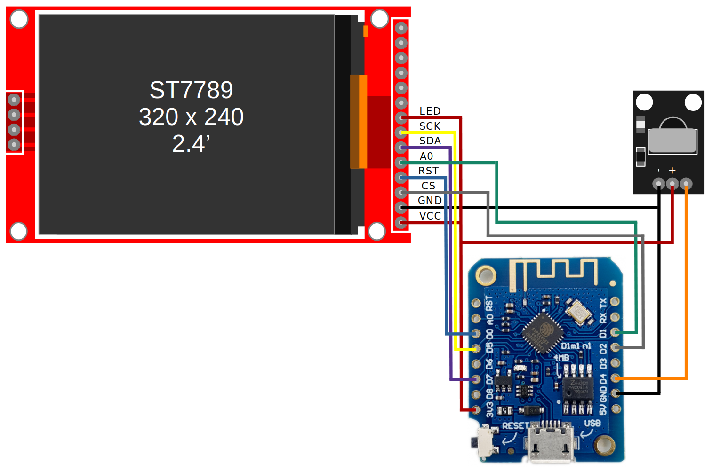
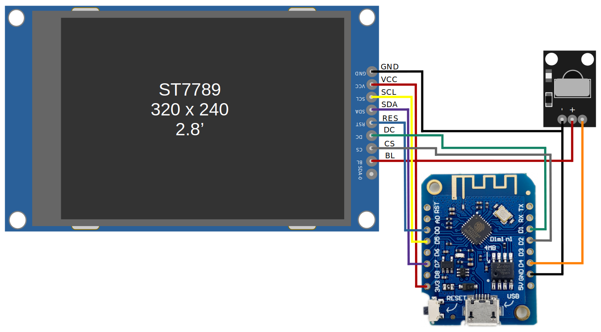

<p align="center">
  
</p>

<div align="center">

**ESP8266 Cryptocurrency Ticker & Portfolio Tracker, with SPI TFT display, and IR functionality.**

</div>
  
# ESPIR Lite

> ESPIR is an ESP8266 powered Crypto Ticker and Portfolio Tracker that uses a TFT screen to display statistics and a candle chart for various cryptocurrencies, as well as a configured portfolio. It utilises an IR remote for configuration and user input. This device is powered by the CoinGecko API.

ESPIR Lite is a rewritten version of this earlier ESPIR repo, with various improvements and removal of unnecessary functionality.

## What is different from Original ESPIR?

| New | Gone |
| - | - |
| Support for 128x128 ST7735 display | Removed 4 coins with small graphs representation |
| Support for 320x240 ST7789 displays | Removed ability to replace coins with new ones (short on EEPROM) |
| Selection of up to 20 coins |  |
| Up to 20 coins allowed in portfolio at any time |  |
| Built on my new Menu Arduino library for easier configuration |  |
| Updated to current top 20 coins (no wrapped coins) |  |
| Uses hardware SPI for increased display refresh rate |  |
| Improved WiFi setup functionality (auto-detect access points, only needs password now) |  |
| More free heap so far more reliable |  |
| Updates prices every 60 seconds, as price updates on API are about this frequent |  |

## Libraries/Requirements

- `Arduino Boards Manager` - ESP8266 Boards : Version **2.7.4**
- `ArduinoJSON` : Version **7.1.0**
- `Adafruit ST7735 & ST7789 Library` : Version **1.9.3** (updating to latest makes text drawing really slow?)
- `IRremote` : Version **4.4.0**
- `Adafruit GFX Library` : Version **1.11.3** (updating to latest makes text drawing really slow?)

## Components
- ESP8266 board (NodeMCU, Wemos D1 mini, etc)
- IR Reciever / Remote
- TFT SPI display

### Supported displays:
- ST7735 128x128 and 160x128
- ST7789 320x240

## Configurations

In each of the following configurations, the TFT init code within `ESPIR_Sketch.ino` will need to be replaced with the specified TFT code.

### ST7735 128x128 1.44'

```
TFT tft = TFT(ST7735_SPI_128_128, TFT_CS, TFT_DC, TFT_SDA, TFT_SCL, TFT_RES);
```

<div align="center">


</div>

### ST7735 160x128 1.8'

```
TFT tft = TFT(ST7735_SPI_160_128, TFT_CS, TFT_DC, TFT_SDA, TFT_SCL, TFT_RES);
```

<div align="center">



</div>

### ST7789 320x240 2.0'

```
TFT tft = TFT(ST7789_SPI_320_240_INVERT, TFT_CS, TFT_DC, TFT_SDA, TFT_SCL, TFT_RES);
```

<div align="center">



</div>

### ST7789 320x240 2.4'

```
TFT tft = TFT(ST7789_SPI_320_240, TFT_CS, TFT_DC, TFT_SDA, TFT_SCL, TFT_RES);
```

<div align="center">



</div>

### ST7789 320x240 2.8'

```
TFT tft = TFT(ST7789_SPI_320_240, TFT_CS, TFT_DC, TFT_SDA, TFT_SCL, TFT_RES);
```

<div align="center">



</div>

## Installation

- Install Arduino, and install all dependencies listed in *Libraries/Requirements*
- Put the *ESPIR_Menu* directory in your Arduino libraries directory
- Open the *ESPIR_Sketch* directory in Arduino
- Select the correct ESP8266 board
- Set the display flag as described above in `ESPIR_Sketch/ESPIR_Sketch.ino` (important or it won't render correctly at all)
- Upload the sketch to your board

