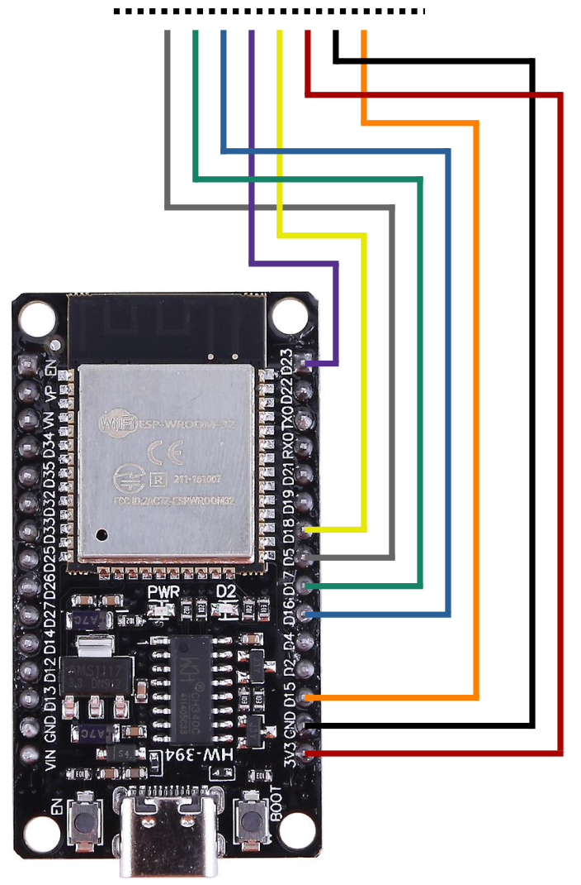

<p align="center">
  
</p>

<div align="center">

**ESP8266 Cryptocurrency Ticker & Portfolio Tracker, with SPI TFT display, and IR functionality.**

</div>
  
# ESPIR Lite

> ESPIR is an ESP8266 powered Crypto Ticker and Portfolio Tracker that uses a TFT screen to display statistics and a candle chart for various cryptocurrencies, as well as a configured portfolio. It utilises an IR remote for configuration and user input. This device is powered by the CoinGecko API.

ESPIR Lite is a rewritten version of this earlier ESPIR repo, with various improvements and removal of unnecessary functionality to improve reliability.

## What is different from Original ESPIR?

| New | Gone |
| - | - |
| Support for more ST7735/ST7789 displays | Removed 4 coins with small graphs representation |
| Selection of up to 20 coins | Removed ability to replace coins with new ones (short on EEPROM) |
| Up to 20 coins allowed in portfolio at any time |  |
| Built on my new Menu Arduino library for easier configuration |  |
| Updated to current top 20 coins (no wrapped coins) |  |
| Uses hardware SPI for increased display refresh rate |  |
| Improved WiFi setup functionality (auto-detect access points, only needs password now) |  |
| More free heap so far more reliable |  |
| Updates prices every 60 seconds, as price updates on API are about this frequent (and less chance of rate limits) |  |

## Libraries/Requirements

### ESP32

- `Arduino Boards Manager` - ESP32 Boards : Version **2.0.18**

### ESP8266

- `Arduino Boards Manager` - ESP8266 Boards : Version **2.7.4**

### Libraries

- `ArduinoJSON` : Version **7.1.0**
- `Adafruit ST7735 & ST7789 Library` : Included in this repo, copy into your libraries folder (uninstall existing version if already installed)
- `IRremote` : Version **4.4.0**
- `Adafruit GFX Library` : Version **1.11.3** (updating to latest makes text drawing really slow?)

## Components
- Compatible ESP8266/ESP32 board (see below)
- Compatible SPI TFT display (see below)
- IR Reciever / Remote


### Supported Displays
- *ST7735*: 128x128, 160x80, 160x128
- *ST7789*: 240x240, 320x240

### Supported Microcontrollers
- *ESP32*: WROOM, C3-ZERO
- *ESP8266*: NodeMCU, D1 MINI

## Installation

- Install Arduino, and install all dependencies listed in *Libraries/Requirements*
- Put the *ESPIR_Menu* and modified *Adafruit_ST7735_and_ST7789_Library* directories in your Arduino libraries directory
- Open the *ESPIR_lite_ESPX.ino* file in the *ESPIR_Sketch_ESPX* directory in Arduino (where X is *32* or *8266* depending on the board you are using)
- At the top of the file, first change the pin definitions to match your board (see Displays in Configurations section)
- Once changed, change the TFT definition to match your display (see Microcontrollers in Configurations section)
- Select the correct board in the board manager (see Microcontrollers in Configurations section - if not installed, install the ESP32 board manager URL)
- Upload the sketch to your board

## Configurations

In each of the following configurations, the TFT init code within `ESPIR_Sketch.ino` will need to be replaced with the specified TFT code.

### Displays

#### ST7735 128x128 1.44'

```
TFT tft = TFT(ST7735_SPI_128_128, TFT_CS, TFT_DC, TFT_RST);
```

<div align="center">


</div>

#### ST7735 160x80 0.96'

```
TFT tft = TFT(ST7735_SPI_160_80, TFT_CS, TFT_DC, TFT_RST);
```

<div align="center">


</div>

#### ST7735 160x128 1.8'

```
TFT tft = TFT(ST7735_SPI_160_128, TFT_CS, TFT_DC, TFT_RST);
```

<div align="center">


</div>

#### ST7789 240x240 1.54'

```
TFT tft = TFT(ST7789_SPI_240_240, TFT_CS, TFT_DC, TFT_RST);
```

<div align="center">


</div>

#### ST7789 320x240 2.0'

```
TFT tft = TFT(ST7789_SPI_320_240_INVERT, TFT_CS, TFT_DC, TFT_RST);
```

<div align="center">


</div>

#### ST7789 320x240 2.4'

```
TFT tft = TFT(ST7789_SPI_320_240, TFT_CS, TFT_DC, TFT_RST);
```

<div align="center">


</div>

#### ST7789 320x240 2.8'

```
TFT tft = TFT(ST7789_SPI_320_240, TFT_CS, TFT_DC, TFT_RST);
```

<div align="center">


</div>

### Microcontrollers

In each of the following configurations, the pin definitions will need to be changed to match the microcontroller.

#### ESP8266 D1 Mini

Board Manager: `LOLIN (WEMOS) D1 mini Lite`

```
#define TFT_DC   D1
#define TFT_CS   D2
#define TFT_RST  D0
#define RECV_PIN D4
```

<div align="center">


</div>

#### ESP8266 NodeMCU

Board Manager: `NodeMCU 1.0 (ESP-12E Module)`

```
#define TFT_DC    D2
#define TFT_CS    D8
#define TFT_RST   D3
#define RECV_PIN  D4
```

<div align="center">


</div>


#### ESP32 C3 Zero

Board Manager: `AirM2M_CORE_ESP32C3`

```
#define TFT_CS   7
#define TFT_DC   9
#define TFT_RST  21
#define RECV_PIN 5
```

<div align="center">


</div>

#### ESP32 WROOM

Board Manager: `ESP32-WROOM-DA Module`

```
#define TFT_CS   5
#define TFT_DC   17
#define TFT_RST  16
#define RECV_PIN 15
```

<div align="center">



</div>


